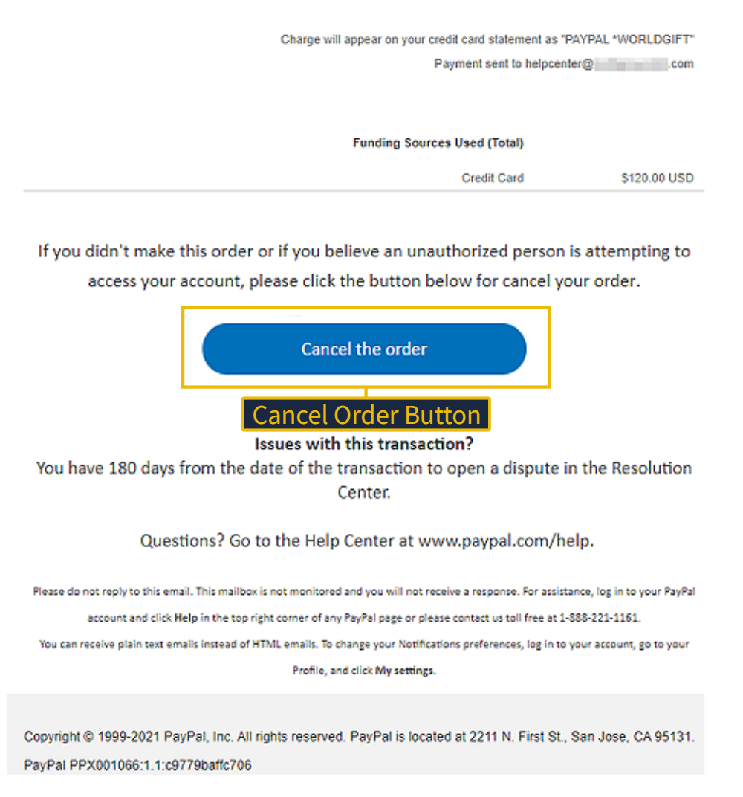
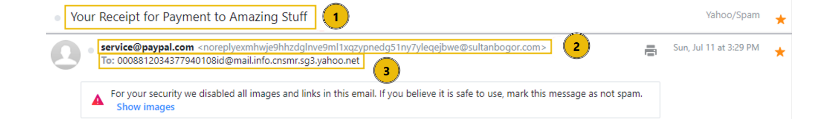
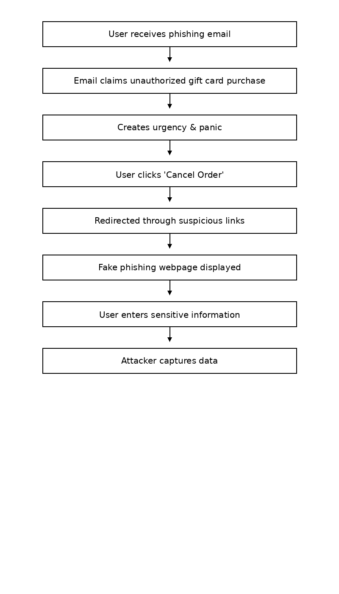

# Phishing Email Analysis – Gift Card Cancellation Scam

## 📌 Overview
This project presents a practical analysis of a phishing email scenario involving a fake gift card purchase notification. The objective is to identify phishing indicators, analyze malicious elements, and understand how such attacks manipulate user behavior.

---

## 📧 Phishing Email Sample

The email claims that a gift card purchase has been made and urges the user to cancel the order if unauthorized.

---

## ⚠️ Suspicious Indicators

- Urgent call-to-action ("Cancel Order")
- Fear-based message (unauthorized transaction)
- Suspicious sender identity
- Mismatch between sender email and claimed organization (spoofing)
- Possible spoofing of a trusted brand

---

## 🔍 Link / URL Analysis

The URL associated with the "Cancel Order" button was analyzed using WhereGoes to track redirections.

### Findings:
- The link redirects through multiple URLs before reaching the final destination
- The final domain does not match the claimed organization
- Indicates a phishing redirection chain used to hide the malicious destination

---

## 🧠 Indicators of Compromise (IOCs)

- Suspicious URL/domain  
- Deceptive transaction message  
- Action-driven phishing button  
- Spoofed sender email  

---

##  Attack Analysis

This attack uses **social engineering techniques**, specifically:

- Urgency ("cancel immediately")
- Financial fear (unauthorized purchase)
- Trust exploitation (branding)

The use of redirection chains and spoofed sender identity indicates an attempt to bypass basic detection mechanisms and increase credibility.

The goal is to trick users into clicking malicious links and potentially entering sensitive information.

---

## 🛡️ Mitigation Strategies

- Avoid clicking links from unknown emails  
- Verify transactions through official websites  
- Enable Multi-Factor Authentication (MFA)  
- Use email filtering systems  

---

##  Tools Used

- WhereGoes  
- OSINT techniques  
- Phishing analysis (TryHackMe lab)

---

##  Key Learning

This analysis demonstrates how phishing attacks combine technical deception (spoofing, redirection) with psychological manipulation (urgency, fear) to increase success rates.

---

## ✅ Conclusion

This project demonstrates how phishing attacks exploit urgency and fear to manipulate user actions. Through practical analysis, key indicators such as sender mismatch and redirection chains were identified, reflecting real-world SOC analyst responsibilities.
