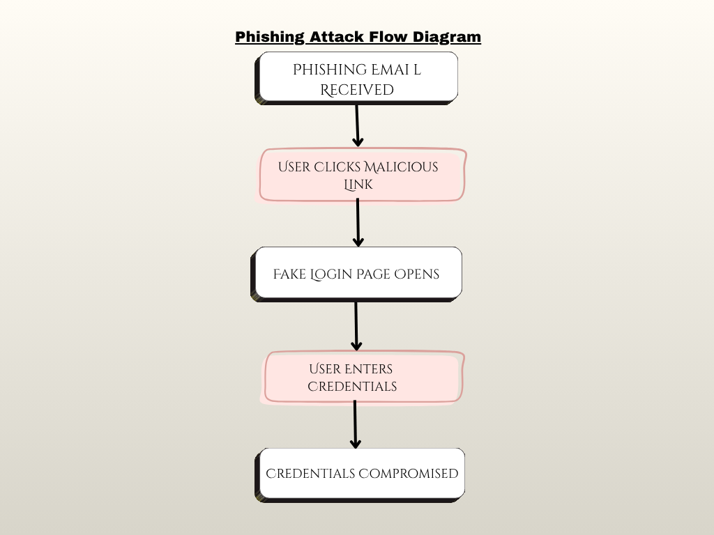

# Phishing Attack Analysis & Detection

A beginner cybersecurity project focused on analyzing phishing attacks and understanding real-world threat detection techniques.

## Overview
This project analyzes a phishing attack scenario to identify social engineering techniques, Indicators of Compromise (IOCs), and methods for detection and prevention.

## Sample Phishing Email

Subject: Urgent: Verify Your Account Immediately

##  Overview
This project focuses on analyzing a phishing attack scenario to understand common social engineering techniques, identify Indicators of Compromise (IOCs), and explore detection and prevention strategies.

---

##  Sample Phishing Email

Subject: Urgent: Verify Your Account Immediately

Dear User,

Your account has been temporarily suspended due to suspicious activity. Please verify your account within 24 hours to avoid permanent suspension.

Click here to verify: http://secure-login-update.com

Thank you,  
Support Team

---

##  Red Flags Identified

- Suspicious sender domain  
- Urgent and threatening language  
- Unverified external link  
- Generic greeting ("Dear User")  
- No official company branding  

---

##  Attack Flow
##  Phishing Attack Flow Diagram

1. User receives phishing email  
2. User clicks malicious link  
3. Fake login page is displayed  
4. User enters credentials  
5. Attacker captures sensitive data  

---

##  Indicators of Compromise (IOCs)

- Malicious domain: secure-login-update.com  
- Suspicious email patterns  
- Unexpected login activity  
- Unknown IP access  

---

##  Detection Techniques

- Email filtering and spam detection  
- URL inspection and validation  
- Domain reputation analysis  
- Monitoring unusual login behavior  

---

##  Prevention Measures

- Enable Multi-Factor Authentication (MFA)  
- Conduct user awareness training  
- Use secure email gateways  
- Avoid clicking unknown links  

---
## Impact Analysis

- Unauthorized access to user accounts  
- Data breaches involving sensitive information  
- Credential reuse across multiple platforms  
- Potential financial or reputational damage  

## Mitigation Strategy

- Implement Multi-Factor Authentication (MFA)  
- Use advanced email filtering systems  
- Conduct regular security awareness training  
- Monitor login anomalies and suspicious activity  

## Tools and Concepts Used

- Cybersecurity Fundamentals  
- Threat Analysis  
- Social Engineering  
- Basic OSINT Concepts 

##  Conclusion

Phishing attacks exploit human behavior through social engineering. Proper awareness, detection mechanisms, and security practices can significantly reduce risks.
